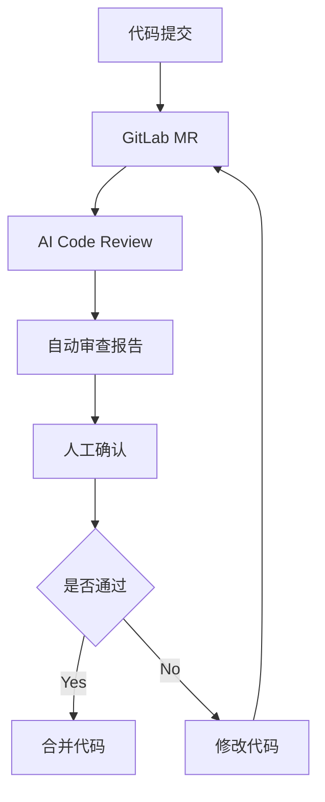
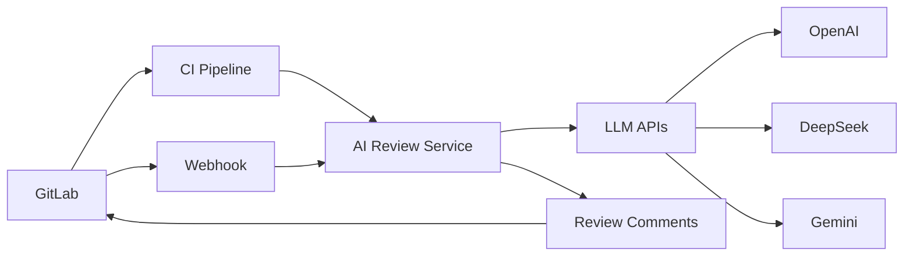
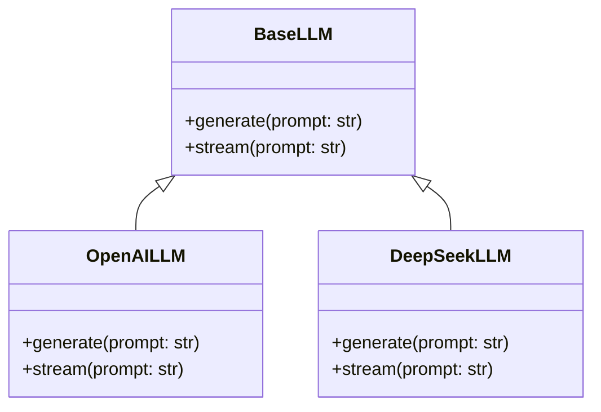
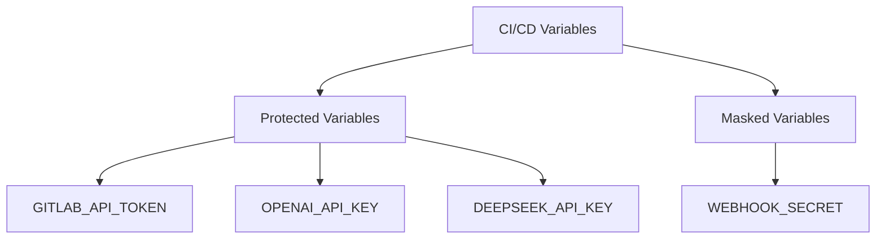
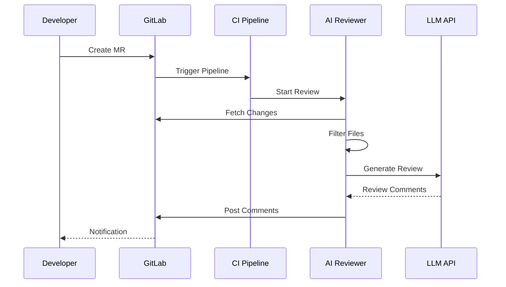
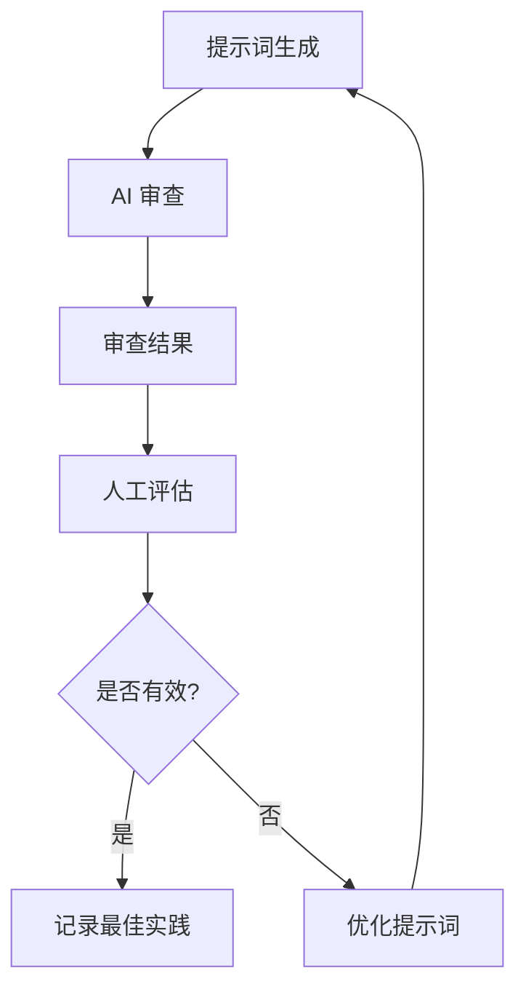
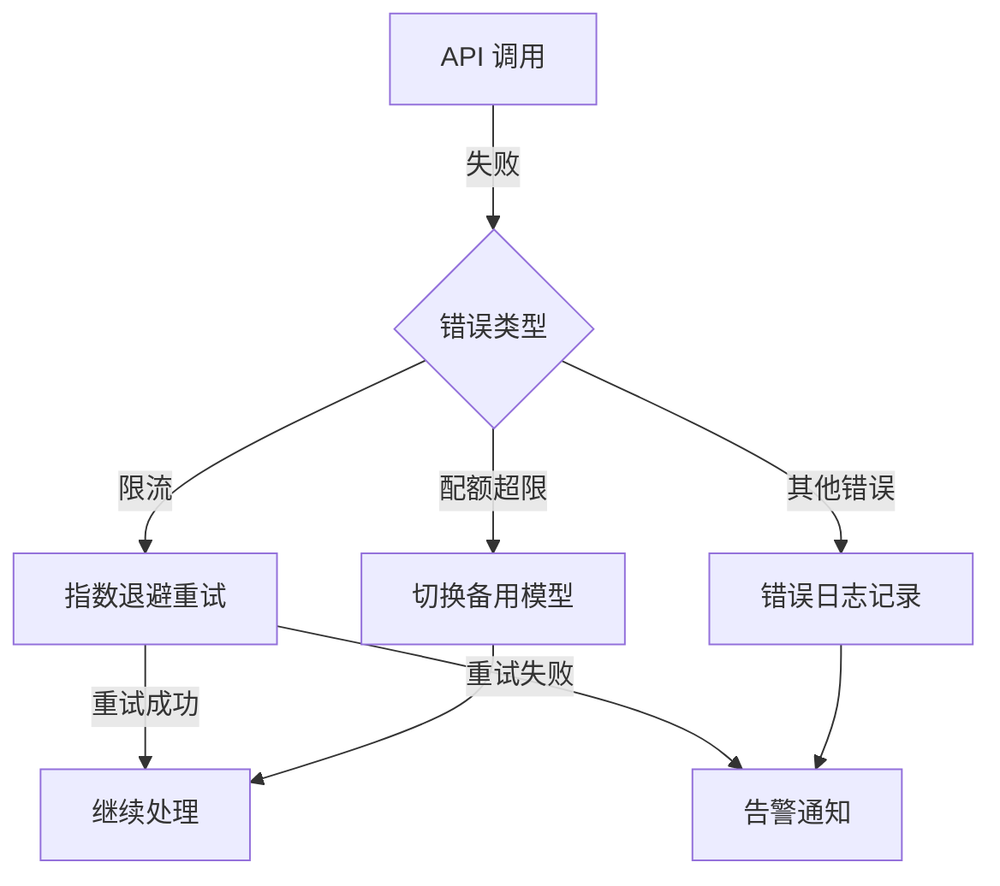
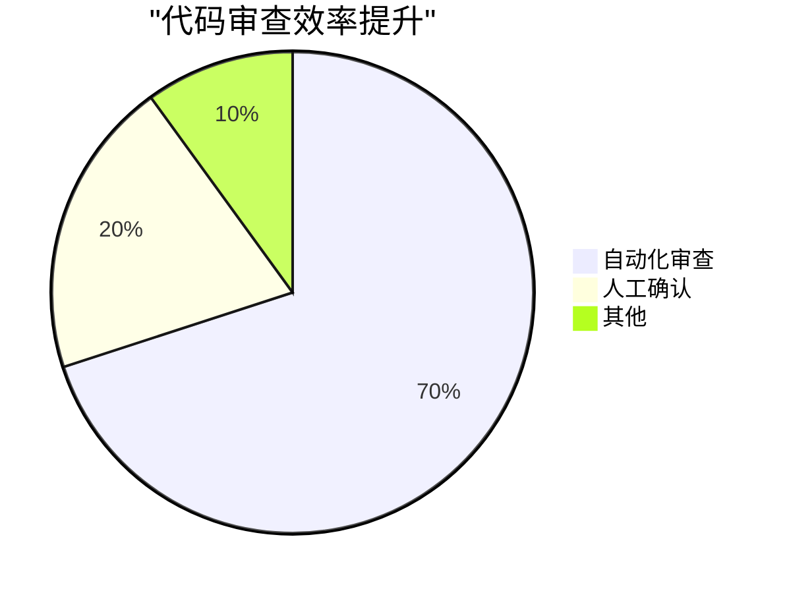
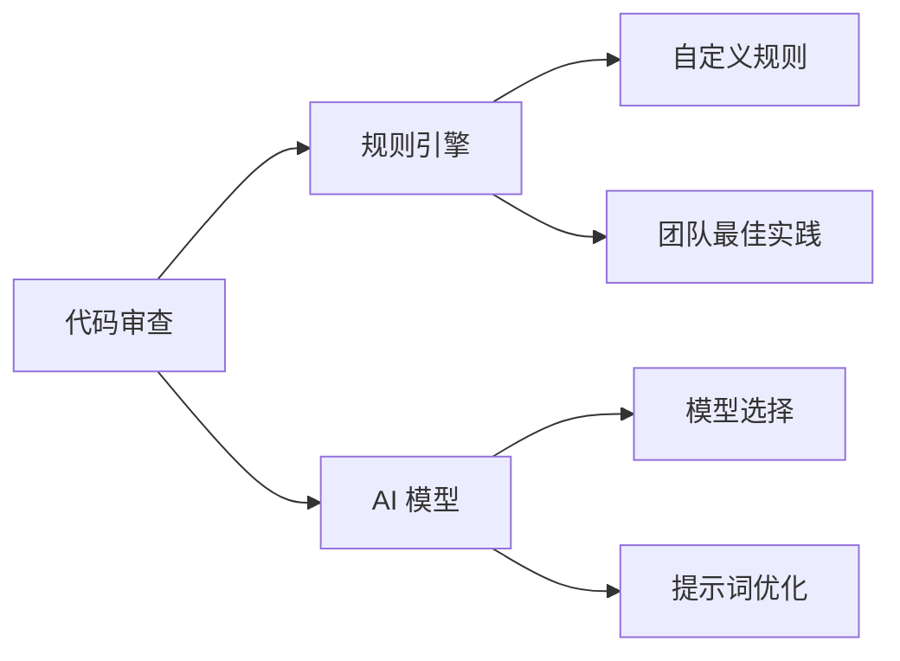

# GitLab AI Code Review 实践分享

> Author: **hewking**  
> Labels: **blog**  
> Created: **2024-12-29T14:14:08Z**  
> Link and comments: <https://github.com/hewking/blog/issues/38>  


## 1. 项目背景

### 1.1 痛点分析

- 人工代码审查耗时费力
- 审查标准不统一
- 易遗漏技术细节
- 无法保证审查质量的一致性

### 1.2 解决方案



### 1.3 技术选型

```python
requirements.txt
├── python-gitlab>=3.15.0    # GitLab API 交互
├── openai>=1.0.0           # OpenAI 集成
├── httpx>=0.24.0           # 异步 HTTP 客户端
├── fastapi>=0.68.0         # Web 框架
└── python-dotenv>=1.0.0    # 环境变量管理
```

## 2. 系统架构

### 2.1 整体架构



### 2.2 CI 配置示例

```yaml
# .gitlab-ci.yml
ai-code-review:
  stage: review
  script:
    - python review_runner.py
  rules:
    - if: $CI_PIPELINE_SOURCE == "merge_request_event"
  variables:
    GITLAB_URL: ${CI_SERVER_URL}
    GITLAB_TOKEN: ${GITLAB_API_TOKEN}
    REVIEW_MODEL: "deepseek"
```

### 2.3 核心组件

#### 2.3.1 多模型适配层



## 3. 关键技术实现

### 3.1 多模型支持

#### 基类设计

```python
class BaseLLM(ABC):
    def __init__(self, api_key: str):
        self.api_key = api_key

    @abstractmethod
    async def generate(self, prompt: str, **kwargs) -> str:
        pass

    @abstractmethod
    async def stream(self, prompt: str, **kwargs) -> AsyncIterator[str]:
        pass
```

#### DeepSeek 实现示例

```python
class DeepSeekLLM(BaseLLM):
    async def generate(self, prompt: str, **kwargs) -> str:
        async with httpx.AsyncClient(base_url=self.base_url) as client:
            response = await self._make_request(prompt)
            return response.json()["choices"][0]["message"]["content"]
```

### GitLab CI/CD 配置

### 1.1 CI/CD Variables 设置

1. 进入项目设置

   ```
   Your Project > Settings > CI/CD > Variables
   ```

2. 添加必要变量



配置环境变量


1. 变量配置说明

```yaml
# 必需变量
GITLAB_API_TOKEN: "your-gitlab-token" # GitLab Personal Access Token
OPENAI_API_KEY: "your-openai-key" # OpenAI API Key
DEEPSEEK_API_KEY: "your-deepseek-key" # DeepSeek API Key
WEBHOOK_SECRET: "your-webhook-secret" # Webhook 安全密钥

# 可选变量
REVIEW_MODEL: "deepseek" # 默认使用的模型
REVIEW_MAX_FILES: "10" # 单次审查最大文件数
REVIEW_MAX_LINES: "500" # 单个文件最大行数
```

### 1.2 创建 GitLab Access Token

1. 个人设置

   ```
   User Settings > Access Tokens
   ```

2. 配置权限

```yaml
Token name: AI-Code-Review
Expiration date: 建议90天
Scopes:
  - api # API 访问权限
  - read_repository # 仓库读取权限
  - write_repository # 评论写入权限
```


## 2. .gitlab-ci.yml 配置

### 2.1 基础配置

```yaml
image: python:3.11-slim

variables:
  PIP_CACHE_DIR: "$CI_PROJECT_DIR/.pip-cache"

cache:
  paths:
    - .pip-cache/
    - venv/

stages:
  - review
```

### 2.2 审查任务配置

```yaml
ai-code-review:
  stage: review
  before_script:
    - python -m venv venv
    - . venv/bin/activate
    - pip install -r requirements.txt
  script:
    - python review_runner.py
  rules:
    - if: $CI_PIPELINE_SOURCE == "merge_request_event"
      when: always
    - when: never
```

## 4. 代码审查流程

### 4.1 审查流程图



### 4.2 智能过滤规则

```python
def _should_review_file(self, file_path: str) -> bool:
    ignore_patterns = [
        r'\.lock$',
        r'package-lock\.json$',
        r'\.gitignore$',
        r'\.env.*',
        r'\.md$',
        # ... 更多规则
    ]
    return not any(re.search(pattern, file_path)
                  for pattern in ignore_patterns)
```

### 4.3 提示词工程

React/React Native 项目的 AI Code Review 提示词工程

## 1. 基础提示词模板

### 1.1 通用代码审查模板

```typescript
const baseReviewPrompt = `作为资深 React/React Native 开发专家，请审查以下代码：

文件路径: {filePath}

代码改动:
{diff}

请重点关注：
1. TypeScript 类型定义完整性
2. React Hooks 使用规范
3. 性能优化机会
4. 组件设计模式
5. 代码可维护性
6. 移动端适配（针对 RN）

请提供具体的改进建议和示例代码。
`;
```

### 1.2 文件类型特定提示词

```typescript
const promptsByFileType = {
  component: `
针对 React 组件代码，请特别注意：
1. Props 和 State 的类型定义
2. useEffect 依赖项完整性
3. 组件拆分和复用机会
4. memo 使用时机
5. 样式组织方式
6. 条件渲染逻辑
  `,

  hook: `
针对自定义 Hook，请重点关注：
1. Hook 命名规范（use 前缀）
2. 返回值类型定义
3. 依赖项处理
4. 清理函数实现
5. 异步操作处理
6. 错误处理机制
  `,

  style: `
针对样式文件，请检查：
1. 响应式设计实现
2. 主题系统集成
3. 样式复用情况
4. 平台特定样式处理
5. 性能影响
6. 命名规范
  `,
};
```

## 2. 场景化提示词

### 2.1 性能相关

```typescript
const performanceReviewPrompt = `
请从性能优化角度审查代码：

{code}

重点关注：
1. 不必要的重渲染
2. 大型列表优化
3. 图片和资源加载
4. 缓存策略
5. 异步操作处理
6. 内存泄漏风险

请给出具体的性能优化建议。
`;
```

### 2.2 状态管理

```typescript
const stateManagementPrompt = `
请评估状态管理实现：

{code}

考虑以下方面：
1. 状态设计合理性
2. Redux/Context 使用场景
3. 状态更新性能
4. 数据流向清晰度
5. 状态同步处理
6. 持久化策略

请提供优化建议。
`;
```

## 3. 具体场景示例

### 3.1 React Native 列表优化

```typescript
const listOptimizationPrompt = `
审查以下 FlatList 实现：

{code}

请检查并优化：
1. renderItem 是否使用 memo
2. keyExtractor 实现
3. 列表配置参数
4. 分页加载实现
5. 空状态处理
6. 刷新机制

示例改进代码：
interface ListItem {
  id: string;
  title: string;
}

const MemoizedItem = memo(({ item }: { item: ListItem }) => (
  <View>
    <Text>{item.title}</Text>
  </View>
));

const optimizedKeyExtractor = (item: ListItem) => item.id;

const OptimizedList: React.FC = () => {
  return (
    <FlatList
      data={items}
      renderItem={({ item }) => <MemoizedItem item={item} />}
      keyExtractor={optimizedKeyExtractor}
      initialNumToRender={10}
      maxToRenderPerBatch={10}
      windowSize={5}
      removeClippedSubviews={Platform.OS === 'android'}
      onEndReachedThreshold={0.5}
      onEndReached={loadMore}
    />
  );
};
`;
```

### 3.2 表单处理优化

```typescript
const formReviewPrompt = `
审查以下表单实现：

{code}

优化重点：
1. 表单状态管理
2. 验证逻辑
3. 错误处理
4. 提交防抖
5. 字段依赖关系
6. 性能优化

示例改进：
interface FormData {
  email: string;
  password: string;
}

const FormComponent: React.FC = () => {
  const { register, handleSubmit, formState: { errors } } = useForm<FormData>();
  const [isSubmitting, setIsSubmitting] = useState(false);

  const onSubmit = useCallback(async (data: FormData) => {
    try {
      setIsSubmitting(true);
      await submitForm(data);
    } catch (error) {
      // 错误处理
    } finally {
      setIsSubmitting(false);
    }
  }, []);

  return (
    <Form onSubmit={handleSubmit(onSubmit)}>
      {/* 表单字段 */}
    </Form>
  );
};
`;
```

## 4. 提示词优化策略

### 4.1 动态提示词生成

```typescript
function generateReviewPrompt(
  fileType: string,
  code: string,
  context: {
    isPerformanceCritical?: boolean;
    hasAsyncOperations?: boolean;
    isNative?: boolean;
  }
) {
  let prompt = baseReviewPrompt;

  // 添加文件类型特定检查项
  prompt += promptsByFileType[fileType] || "";

  // 根据上下文添加特定检查项
  if (context.isPerformanceCritical) {
    prompt += performanceReviewPrompt;
  }

  if (context.hasAsyncOperations) {
    prompt += asyncOperationsPrompt;
  }

  if (context.isNative) {
    prompt += reactNativeSpecificPrompt;
  }

  return prompt.replace("{code}", code);
}
```

### 4.2 提示词效果评估



## 5. 工程实践

### 5.1 异步处理优化

```python
async def review_merge_request(self, mr_iid: int) -> None:
    mr = self.project.mergerequests.get(mr_iid)
    changes = mr.changes()

    # 并发处理多个文件的审查
    tasks = []
    for change in changes.get('changes', []):
        task = self._review_file_changes(mr, change)
        tasks.append(task)

    await asyncio.gather(*tasks)
```

### 5.2 错误处理和重试机制



### 5.3 安全性考虑

- API Key 轮转机制
- 敏感信息过滤
- 访问权限控制

```python
# 环境变量配置示例
GITLAB_TOKEN = os.getenv("GITLAB_API_TOKEN")
WEBHOOK_SECRET = os.getenv("WEBHOOK_SECRET")
MODEL_API_KEYS = {
    "openai": os.getenv("OPENAI_API_KEY"),
    "deepseek": os.getenv("DEEPSEEK_API_KEY")
}
```

## 6. 应用效果

### 6.1 量化指标



Gitlab 代码审查结果


### 6.2 实际案例分析

#### 代码质量改进示例

组件定义优化

```diff
- function ProductList() {
-   const [products, setProducts] = useState([]);
-   const [loading, setLoading] = useState(true);
-   const [error, setError] = useState(null);
-
-   useEffect(() => {
-     fetch('/api/products')
-       .then(res => res.json())
-       .then(data => setProducts(data))
-       .catch(err => setError(err))
-       .finally(() => setLoading(false));
-   }, []);
-
-   return loading ? <div>Loading...</div> : <div>{products.map(...)}</div>;
- }

+ interface Product {
+   id: string;
+   name: string;
+   price: number;
+ }
+
+ interface UseProductsResult {
+   products: Product[];
+   loading: boolean;
+   error: Error | null;
+   refetch: () => Promise<void>;
+ }
+
+ const useProducts = (): UseProductsResult => {
+   const [state, setState] = useState<{
+     products: Product[];
+     loading: boolean;
+     error: Error | null;
+   }>({
+     products: [],
+     loading: true,
+     error: null
+   });
+
+   const fetchProducts = useCallback(async () => {
+     try {
+       setState(prev => ({ ...prev, loading: true }));
+       const response = await fetch('/api/products');
+       const data = await response.json();
+       setState({ products: data, loading: false, error: null });
+     } catch (error) {
+       setState(prev => ({
+         ...prev,
+         error: error as Error,
+         loading: false
+       }));
+     }
+   }, []);
+
+   useEffect(() => {
+     fetchProducts();
+   }, [fetchProducts]);
+
+   return { ...state, refetch: fetchProducts };
+ };
+
+ const ProductList: React.FC = () => {
+   const { products, loading, error, refetch } = useProducts();
+
+   if (loading) return <Spinner />;
+   if (error) return <ErrorMessage retry={refetch} />;
+
+   return (
+     <ProductGrid>
+       {products.map(product => (
+         <ProductCard key={product.id} product={product} />
+       ))}
+     </ProductGrid>
+   );
+ }
```

AI 审查建议：

1. 类型定义：添加了 UserData 和 Props 接口定义
2. 错误处理：增加了错误处理和加载状态
3. 组件分离：将 UI 拆分为更小的组件
4. 性能优化：添加了 useEffect 依赖项
5. 空状态处理：增加了加载和错误状态展示

## 7. 未来规划

### 7.1 功能增强

- 自定义规则引擎
- 团队特定检查项
- 多语言支持

### 7.2 架构优化



## 8. 经验总结

### 8.1 最佳实践

1. 合理的文件过滤规则
2. 精确的提示词设计
3. 完善的错误处理
4. 异步并发优化

### 8.2 注意事项

1. API 限流处理
2. 敏感信息保护
3. 成本控制策略
4. 审查质量把控

### 8.3 改进方向

1. 提示词持续优化
2. 自定义规则扩展
3. 团队反馈收集
4. 性能持续优化

这个项目的完整代码已开源在 GitLab，欢迎参考和贡献：
[项目地址](https://github.com/hewking/AIPlayground)
